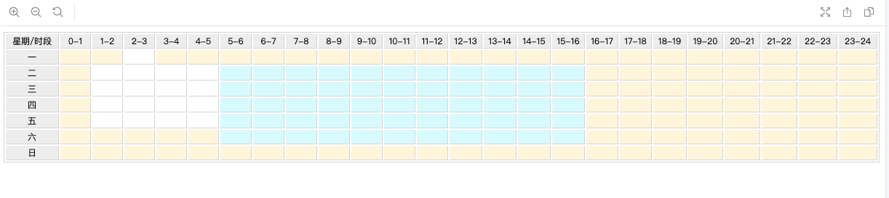

# drag-select-rc
- A drag-select react component
[Storybook Demo](https://laclys.github.io/drag-select-rc/storybook-static/)


### Installation
- `npm instal git@github.com:laclys/drag-select-rc.git --save`

### Usage

``` javascript
import React, { useState } from "react";
import DragSelect from "drag-select-rc";
import "./table.scss";

const WEEK_S = ["一", "二", "三", "四", "五", "六", "日"];

export const index = () => {
  // eslint-disable-next-line react-hooks/rules-of-hooks
  const [cells, setCells] = useState(initCellsFunc());
  const changeDrag = (val) => {
    action('draged!')
    setCells(val)
  };

  return (
    <DragSelect value={cells} onChange={changeDrag}>
      <tr>
        <td disabled>星期/时段</td>
        {Array(24)
          .fill(null)
          .map((item, index) => (
            <td disabled key={index}>{`${index}-${index + 1}`}</td>
          ))}
      </tr>
      {Array(7)
        .fill(null)
        .map((item, index) => {
          return (
            <tr key={`${index}__TR`}>
              <td disabled>{WEEK_S[index]}</td>
              {Array(24)
                .fill(null)
                .map((ele, idx) => (
                  <td key={idx} />
                ))}
            </tr>
          );
        })}
    </DragSelect>
  );
};

// helpers
const initCellsFunc = () => {
  let arr = new Array(8); // 25rows
  for (let i = 0; i < arr.length; i++) {
    arr[i] = new Array(25).fill(true);
  }
  return arr;
};

```
```scss
// table.scss
$border-color: #d9d9d9;
$disabled-color: #efefef;
$selected-color: #fff6de;
$being-selected-color: #defbff;

.table-drag-select {
  width: 100%;
  word-break: break-word;
  border: 1px solid $border-color;
  font-size: 10px;
}

.table-drag-select td {
  min-width: 30px;
  min-height: 30px;
  border-right: 1px solid $border-color;
  border-bottom: 1px solid $border-color;
}

.table-drag-select td.cell-enabled {
  background: white;
  cursor: cell;
}

.table-drag-select td.cell-disabled {
  text-align: center;
  background: $disabled-color;
}

.table-drag-select td.cell-selected {
  background-color: $selected-color;
}

.table-drag-select td.cell-being-selected {
  background-color: $being-selected-color;
}

```


### Dev
- `npm run storybook` run storybook server on http://localhost:9009/
- `npm run build-storybook` build storybook-static
- `npm run build`


### Features
- Test

Have fun 👿
